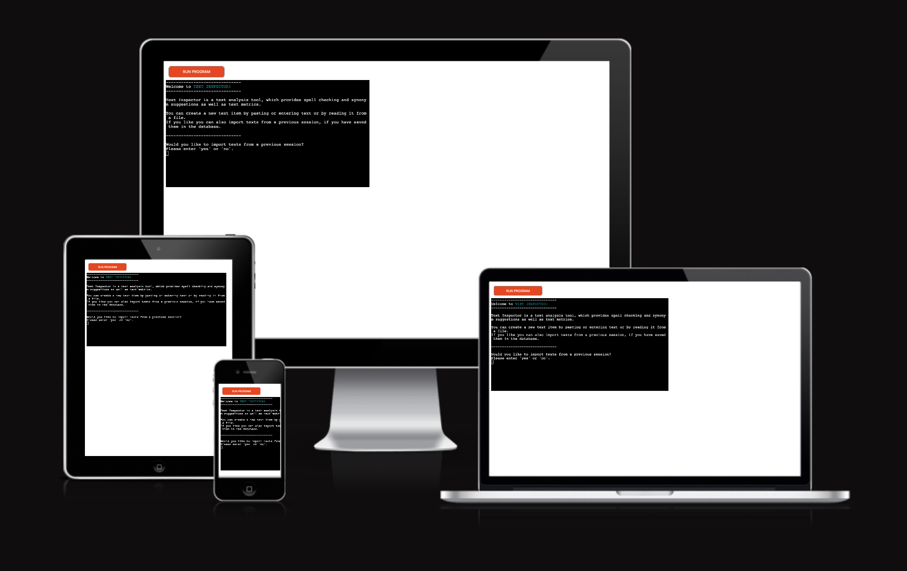

# Text Inspector
## A quick and lightweight text analysis tool

[Text Inspector](https://github.com/nacht-falter/text-inspector) is a quick and easy to use command line tool for text analysis in the English language, written in python using [NLTK](https://www.nltk.org) and [pyspellchecker](https://github.com/barrust/pyspellchecker). The tool provides features such as spell checking, synonym suggestion and text metrics and can process plain text files or read from user input.

It aims to provide a quick and lightweight command line alternative to more comprehensive tools. The application targets all writers, who want to quickly gain a deeper understanding of a text, without getting distracted by flashy user interfaces or browser extensions.

[Text Inspector](https://github.com/nacht-falter/text-inspector) includes an import/export feature, which allows for storing and recovering texts from previous sessions.

[Live version of the project on Heroku](https://text-inspector.herokuapp.com/)



## Features

### Existing features
#### Import texts from storage
- On starting the application, you can decide if you want to import texts from the database. If you have previously used [Text Inspector](https://github.com/nacht-falter/text-inspector) and exported your texts, you can enter your recovery key to restore your texts. The texts will then be available from the text selection menu.
- For demonstration purposes, you can enter `examples` in the recovery key input field, which will import some example texts from the database.


#### Text selection
- From the text selection menu, you can select a text, either by loading it from storage or by creating a new text. The option to load a text will only be available if you have already created a new text item or if you have imported texts from the database.
- When you decide to load an existing text, you can preview the available texts before selecting one. You can also delete texts you don't need anymore from this menu.


#### Text creation
- When you create a new text item, you will be asked to provide a title for the text. Next, you can choose to enter the text from the command line or to provide a text file.
- If you decide to enter text from the command line, you can paste the text or enter it manually. To save your input, enter `Done!` on a new line and press Enter. (Alternatively, you can try pressing `Ctrl-D` (or `Ctrl-Z` on Windows) on a new line.)
- Providing a text file will only work, if you are running [Text Inspector](https://github.com/nacht-falter/text-inspector) locally on your machine. If you are using the [version deployed to Heroku](https://text-inspector.herokuapp.com/), you can read from example files uploaded to the server to test the feature.


#### Text processing
- Once you have created or selected a text, you can select one of four options:
	- **Spell check**: This will check your text for spelling errors and display suggestions for each mistake found. You can decide to accept a correction, provide a custom suggestion, or skip to the next mistake.
	- **Suggest synonyms**: This will check the text for repeatedly used words and suggest synonyms for each word. This feature is meant to provide insight into frequently used words in the text and does not provide the option to replace the original words with the suggested synonyms (may be added in the future). You will have to do that yourself using your favorite text editor.
	- **Text metrics**: This will display metrics for the selected text:
		- Total word count
		- Unique word count
		- Sentence count
		- Longest/shortest sentence
		- Average words per sentence
		- Frequently used words (lemmatized and very common words not included)
	- **Save text**: This will save changes made to the text and return to the text selection menu.
 

#### Exporting texts
When you exit the application from the text selection menu, you can decide, if you want to store your text items in the database. If you choose to do that, you will be provided with a recovery key, which you can use to restore your saved texts on your next visit.

The current version of [Text Inspector](https://github.com/nacht-falter/text-inspector) uses [Google Sheets](https://www.google.com/sheets/about/) to store the text items, and your texts will be stored in plain text. Please make sure your exported texts do not contain any sensitive information!


### Future features
- Read input from URL: Let the user provide a URL to a text file as an alternative to command line input or reading a local file.
- User dictionary: Let the user add words to a custom dictionary, serving as a white-list for the spell check feature.
- Let user accept or reject synonym suggestions.
- Add readability score to text metrics
- Add support for other languages than English.

## Design

### Data model
The application is based on a class as the primary data model. For each text item created by the user, the application creates an instance of the `Text` class, which stores the title and the text contents as instance attributes. Furthermore, the class provides the central functionality of the application by supplying methods for spell checking, synonym suggestion and text metrics. 

### Workflow
The application has a basic workflow with two main menus:
- Text selection menu: The text selection menu allows the user to create new text items and manage existing texts.
- Text processing menu: The text processing menu allows the user to perform different tasks on the currently selected text, such as spell checking, synonym suggestion and displaying text metrics.

[Flowchart of application workflow](media/text-inspector_final-flowchart.png)

[Flowchart of the initial project scope](media/text-inspector_initial-flowchart.png)

### Security and privacy
- All user input is validated to make sure that it is in the expected format and doesn't contain unexpected characters or values. After validation, user input is only processed as a string to prevent security issues like code injection.
- Before exporting texts to the database, users will see a warning, telling them that the texts should not contain any sensitive information, since they will be stored in plain text. The Google spreadsheet used as text storage is not publicly accessible.
- The credentials for the Google Drive API are not included in the repository. An example credentials file has been included for reference.

## Installation

- Clone the repository: `git clone https://github.com/nacht-falter/text-inspector.git`
- For a local installation, you will only need three files:
	- `run.py` → The main application file
	- `requirements.txt` → A list of dependencies
	- `creds.json` → Google Drive API credentials (not included in the repository, you need to [create it yourself](#google-api-credentials)) 
 - The remaining files are only necessary for [deployment to Heroku](#deployment)
 
### Installing dependencies
- Enter the folder: `cd text-inspector` and run: `pip install -r requirements.txt` to install all dependencies.
- Then download the required NLTK modules:
	```
	python3
	>>> import nltk
    >>> nltk.download("punkt", "wordnet", "stopwords")
	```
- Follow [these instructions](https://stackoverflow.com/questions/38916452/nltk-download-ssl-certificate-verify-failed), if you get an error message like:
	```
	[nltk_data]     CERTIFICATE_VERIFY_FAILED] certificate verify failed:
	[nltk_data]     unable to get local issuer certificate (_ssl.c:997)>
	```
### Google API credentials
- Create a [Google Cloud project](https://developers.google.com/workspace/guides/create-project).
- Then [enable the Google Sheets API and Google Drive API](https://developers.google.com/workspace/guides/enable-apis).
- [Create access credentials for the Google Drive API](https://developers.google.com/workspace/guides/create-credentials) with a service account. Set the role to `Editor`.
- Copy the downloaded JSON file with the credentials to the `text-inspector` folder and rename it to `creds.json`. You can check out the file [[example_credentials.json]] in the repository to make sure your credentials have the correct format.

### That's it!
You can now run the application: `python3 run.py`

## Technologies Used

### Languages
- The application itself is written in Python. 
- For the [deployment to Heroku](#deployment), a [template provided by Code Institute](https://github.com/Code-Institute-Org/p3-template) has been used. The template primarily uses HTML, JavaScript, Python, Shell, and Docker.

### Libraries and other software
#### External Python libraries
The application uses the following external Python libraries:
- [NLTK](https://www.nltk.org) : Text tokenization, synonym suggestions and [lemmatization](https://en.wikipedia.org/wiki/Lemmatisation).
- [pyspellchecker](https://github.com/barrust/pyspellchecker): Spell checking.
- [gspread](https://github.com/burnash/gspread): Interface for the Google Sheets API
- [google-auth](https://github.com/googleapis/google-auth-library-python): Google Drive API authentication
- [termcolor](https://github.com/termcolor/termcolor): Color formatting for terminal output

#### Git 
- [Git](https://git-scm.com/) is being used for version control by committing changes to Git and pushing them to GitHub from the command line.

#### GitHub 
- [GitHub](https://github.com/) is used to store the code after being pushed from Git at the repository available at: https://github.com/nacht-falter/text-inspector
- [GitHub Projects](https://docs.github.com/en/issues/planning-and-tracking-with-projects/learning-about-projects/about-projects) has been used to track issues and manage tasks in the development process. The project board can be found here: https://github.com/users/nacht-falter/projects/2

#### Lucidchart
- [Lucidchart](https://www.lucidchart.com/) was used to create the flowcharts for the application workflow.

#### Google Sheets and Google Drive
- [Google Sheets](https://www.google.com/sheets/about/) and [Google Drive](https://drive.google.com/drive/my-drive) are being used as a permanent storage for texts created and exported by users.

#### Am I Responsive
- [Am I Responsive](http://ami.responsivedesign.is/) Mockup Generator was used to create the mockup image in this README.

#### regex101
- [regex101](https://regex101.com/) was used to build and test regular expressions.

## Testing

### PEP 8 Linter
The code in `run.py` passes through the [Code Institute python linter](https://pep8ci.herokuapp.com/) with no issues.

[Test result](media/ci-python-linter-results.png).

### Manual testing
- All features of the application were thoroughly tested to ensure that they work as expected.
- All user input validations were tested by giving invalid values, such as empty strings, out of bound values or wrong data types.
- The code has been tested in a local terminal on macOS and in the Code Institute Heroku terminal.
- All user stories have been tested: [User story test results](testing/text-inspector-user-story-test.md)

### Bugs
| Bug | Fix |
| ----------- | ----------- |
| Terminating command line input by pressing `Ctrl-D` (`Ctrl-Z` on Windows) does not work in the Heroku terminal. | The process of reading lines is now terminated by typing `Done!` on a new line. In a local terminal it is still possible to use `Ctrl-D` or `Ctrl-Z` |
| The spell checking function terminated early before the end of the text was reached, when iterating over the list of misspelled words. | Use a list comprehension instead of a set to return misspelled words from spellchecker to ensure that the number of misspelled words and the number of matching words always match. |
| The export function was causing a NameError because it was checking for a variable, which is not always defined. | Use a try-except statement to catch the NameError |

## Deployment

- The project was deployed to [Heroku](https://heroku.com) using the [Code Institute mock terminal template](https://github.com/Code-Institute-Org/p3-template). The live version of the project can be found here: https://text-inspector.herokuapp.com
- For the installation of NLTK in Heroku, a file named `nltk.txt` containing all NLTK modules to be installed [needs to be present in the root directory of the repository](https://devcenter.heroku.com/articles/python-nltk)
- The necessary steps to deploy the project are:
	- Clone or fork the repository.
	- Create a new app from the [Heroku dashboard](https://dashboard.heroku.com).
	- Go to the Settings tab and click on `Reveal Config Vars` in the Config Vars section.
	- Add a config var named `CREDS` and paste the contents of your `creds.json` file into the `value` field.
	- Add another config var named `PORT` with a value of `8000`.
	- Add `Python` and `NodeJS` to the Buildpacks section (in that order).
	- Click on the Deploy tab and connect the Heroku app to the GitHub repository.
	- Choose the branch you want to deploy in the Manual deploy section and click on **Deploy Branch**.

## Credits

The following resources were used in the project:

### Code
- Colorize terminal output: https://stackoverflow.com/questions/37340049/how-do-i-print-colored-output-to-the-terminal-in-python
- Check string for special character: https://stackoverflow.com/questions/19970532/how-to-check-a-string-for-a-special-character
- Get multiline user input: https://stackoverflow.com/questions/30239092/how-to-get-multiline-input-from-the-user
- pyspellchecker documentation: https://pyspellchecker.readthedocs.io
- Text tokenization with regular expression: https://stackoverflow.com/questions/367155/splitting-a-string-into-words-and-punctuation
- Finding synonyms with NLTK: https://towardsdatascience.com/synonyms-and-antonyms-in-python-a865a5e14ce8
- Text tokenization with NLTK: https://www.nltk.org/api/nltk.tokenize.html?highlight=tokenize#module-nltk.tokenize
- Filter out common words by using stop words: https://pythonspot.com/nltk-stop-words/
- Retrieve lemmas from WordNetLemmatizer: https://www.nltk.org/api/nltk.stem.wordnet.html?highlight=lemmatizer#nltk.stem.wordnet.WordNetLemmatizer
- Sorting a dictionary: https://realpython.com/sort-python-dictionary/#getting-keys-values-or-both-from-a-dictionary
- Get sentence count in a text: https://stackoverflow.com/questions/15228054/how-to-count-the-amount-of-sentences-in-a-paragraph-in-python
- Get function name: https://stackoverflow.com/questions/251464/how-to-get-a-function-name-as-a-string
- Get a functions docstring: https://stackoverflow.com/questions/34277363/how-to-print-your-functions-documentation-python
- Track how often a function is called: https://stackoverflow.com/questions/21716940/is-there-a-way-to-track-the-number-of-times-a-function-is-called
- Clear the console: https://www.pythonpip.com/python-tutorials/how-to-clear-console-in-python/
- Check if variable is defined: https://stackoverflow.com/questions/1592565/determine-if-variable-is-defined-in-python
- Generate random string: https://stackoverflow.com/questions/2030053/how-to-generate-random-strings-in-python
- Delete a worksheet with gspread: https://docs.gspread.org/en/latest/user-guide.html#deleting-a-worksheet
- Create new worksheet with gspread: https://docs.gspread.org/en/latest/user-guide.html#creating-a-worksheet

### Example texts
The example texts in the files [example1.txt](example1.txt) and [example2.md](example2.md) and in the Google Sheets database were found at:
- https://www.gutenberg.org/ebooks/145
- https://www.gutenberg.org/ebooks/64317
- https://www.gutenberg.org/ebooks/345
- https://www.gutenberg.org/ebooks/2641
- https://en.wikipedia.org/wiki/Mantis_shrimp

### Acknowledgements
- I would like to thank my Code Institute mentor Can for his continued support and helpful advice.
- I would like to thank the Code Institute tutors for their support.
- I would like to thank all friends and family members who have tested the application for their helpful feedback and suggestions.